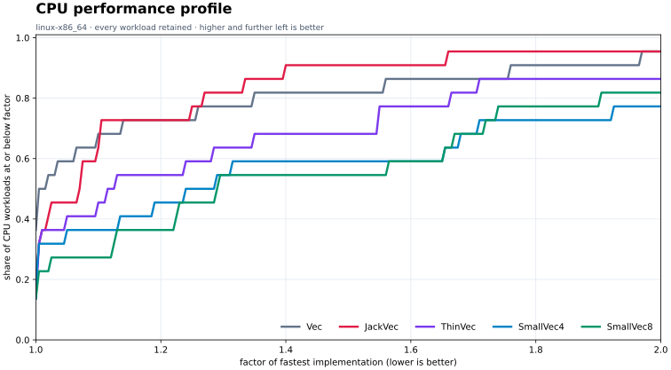
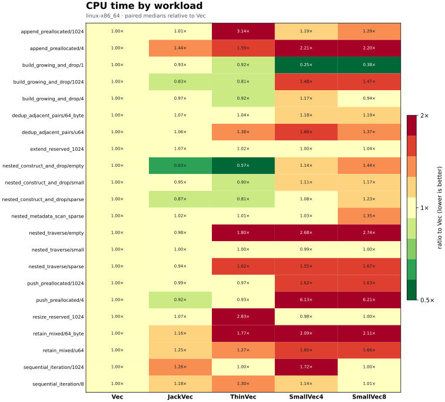
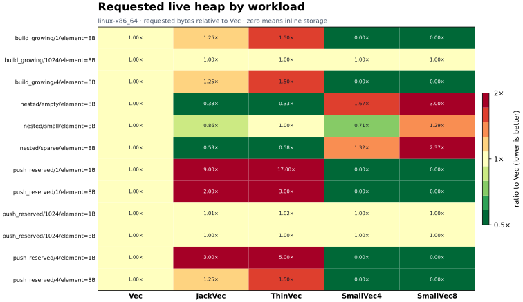
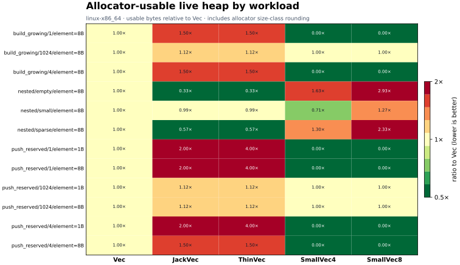

# Latest benchmark comparison

This is the authoritative `linux-x86_64` baseline. Lower ratios are
better. CPU classifications and heatmap ratios use `Vec` as the baseline; red
does not mean an implementation lost to every other candidate. Every measured
implementation and scenario is retained, and platforms are never pooled.

## What this baseline says

- JackVec is not an across-the-board faster `Vec`: it has
  7 confidence-qualified wins and
  6 losses versus `Vec` in this matrix.
- Its intended nested-density advantage is substantial: requested memory for the
  empty and sparse nested workloads is
  0.333× and
  0.526× Vec,
  respectively, while each collection owner remains one machine word.
- The optimized large append path reaches
  1.025× Vec and
  0.311× upstream
  ThinVec. This is a large targeted improvement, not a universal CPU claim.
- JackVec's three largest median CPU gaps versus Vec are `append_preallocated/4` (1.323×), `retain_mixed/u64` (1.238×), `retain_mixed/64_byte` (1.105×). They are
  retained here as investigation targets; confidence-aware classifications remain
  authoritative over point-estimate ordering.
- Against the inline candidates, JackVec wins most measured CPU medians, while
  SmallVec avoids heap allocation when values fit inline. Neither representation
  dominates every workload.

## CPU outcomes

The confidence-aware classifications below compare each implementation with
`Vec`. “Inconclusive” means the paired 95% interval crosses a boundary; it is not
silently counted as equality.

| Implementation | Wins | Equivalent | Inconclusive | Losses |
|---|---:|---:|---:|---:|
| JackVec | 7 | 5 | 4 | 6 |
| ThinVec | 8 | 5 | 2 | 7 |
| SmallVec4 | 5 | 3 | 1 | 13 |
| SmallVec8 | 4 | 2 | 2 | 14 |

For direct context, this simpler head-to-head table compares median CPU times
using the same ±3% practical band. It does not replace the confidence-aware table.

| JackVec compared with | JackVec faster | Within ±3% | JackVec slower |
|---|---:|---:|---:|
| Vec | 9 | 7 | 6 |
| ThinVec | 7 | 13 | 2 |
| SmallVec4 | 13 | 4 | 5 |
| SmallVec8 | 13 | 4 | 5 |

## Memory outcomes

Requested and allocator-usable heap are deliberately separate. Requested bytes
show representation savings; usable bytes show what the measured allocator
actually retained after size-class rounding.

Collection-owner size is not included in those heap ratios. A `Vec` owner is 24
bytes, a JackVec or ThinVec owner is 8 bytes, and SmallVec owners vary with inline
capacity and element alignment. In nested rows the outer allocation already
contains every inner owner, so adding the owner column to live heap would double
count memory. See [the complete platform table](linux-x86_64.md) for
owner bytes, absolute requested/usable bytes, allocation counts, reallocations,
and spill counts.

## Run provenance

- Commit: `2dc82e0656ba2c3997c4dc2dd26b905ce621bb2f`
- Compiler: `1.97.0` (`2d8144b7880597b6e6d3dfd63a9a9efae3f533d3`)
- Allocator policy: `system`; inherited injection:
  `{'DYLD_INSERT_LIBRARIES': None, 'LD_PRELOAD': '/usr/lib/x86_64-linux-gnu/libtcmalloc_minimal.so.4'}`; effective injection:
  `{'DYLD_INSERT_LIBRARIES': None, 'LD_PRELOAD': None}`
- CPU rounds: 5; CPU rows: 110; allocation rows: 60
- Minimum pinned-core idle audit: 100.0%
- Maximum audited one-minute load: 1.13

The performance profile reports the fraction of workloads within each factor of
the fastest implementation for that workload. It is an aggregate view, not a
claim that all workloads are equally representative. The heatmaps preserve the
individual results. These microbenchmarks describe the listed operations, element
types, sizes, compiler, allocator, and machine—not every application. macOS
remains pending until a clean authoritative run is available.
